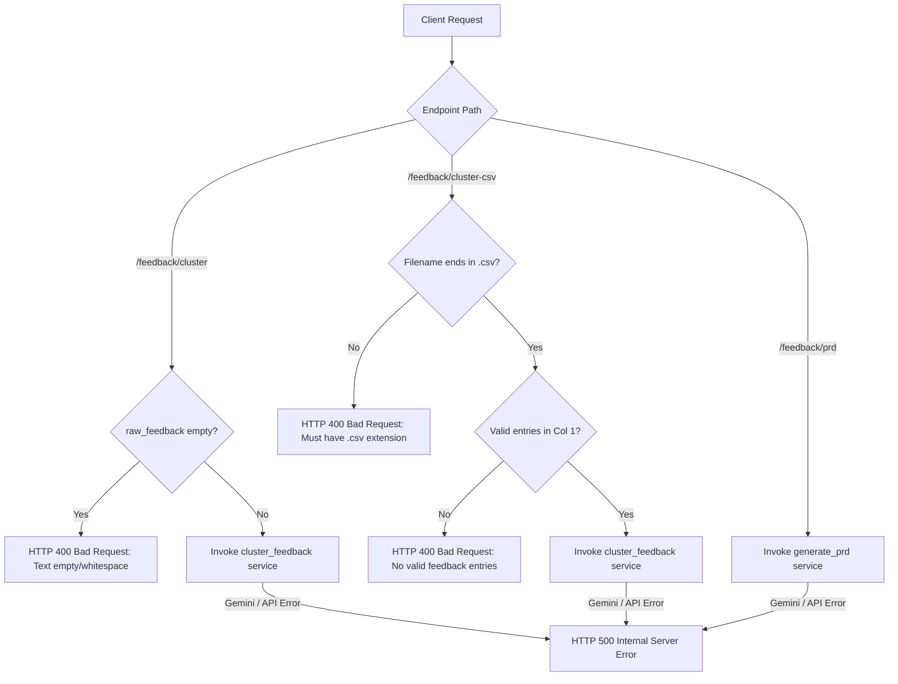
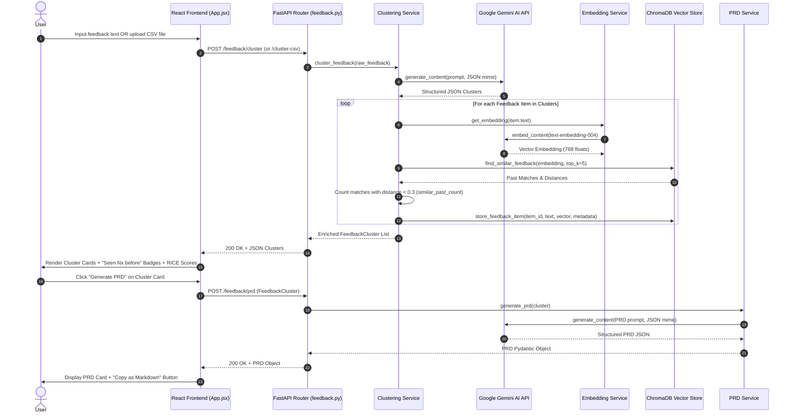

# 🏗️ EchoInsight — Project Architecture & Technical Documentation

> **EchoInsight** is an autonomous AI-driven customer feedback-to-PRD product management pipeline built with **FastAPI**, **React (Vite)**, **Google Gemini AI**, and **ChromaDB Vector Store**.

---

## 📑 Table of Contents
1. [Project Overview & Objective](#1-project-overview--objective)
2. [Tech Stack & Frameworks](#2-tech-stack--frameworks)
3. [Repository Structure & Directory Map](#3-repository-structure--directory-map)
4. [Routing & API Architecture](#4-routing--api-architecture)
5. [Data Flow & Business Logic](#5-data-flow--business-logic)
6. [Configuration & Environment Variables](#6-configuration--environment-variables)
7. [Deployment & Infrastructure Setup](#7-deployment--infrastructure-setup)
8. [Branch Context & Feature Scope](#8-branch-context--feature-scope)
9. [Known Issues & Tech Debt](#9-known-issues--tech-debt)
10. [Third-Party Integrations & External Services](#10-third-party-integrations--external-services)
11. [Testing & CI/CD Pipelines](#11-testing--cicd-pipelines)
12. [Change Log / Living History](#12-change-log--living-history)

---

## 1. Project Overview & Objective

### Core Purpose
Product Managers routinely receive hundreds of raw customer feedback items from emails, support tickets, CSV exports, and user reviews. Manually sifting through feedback, categorizing themes, calculating urgency, checking for repeated past user complaints, and drafting Product Requirements Documents (PRDs) takes hours of manual effort.

**EchoInsight** automates this entire pipeline end-to-end:
1. **Raw Input Ingestion**: Accepts raw line-separated text or CSV file uploads.
2. **AI Classification & Categorization**: Leverages Google Gemini AI to analyze feedback items for:
   - **Sentiment**: `Positive`, `Negative`, `Neutral`
   - **Intent**: `Bug`, `Feature Request`, `UX Friction`
   - **Urgency**: `Low`, `Medium`, `High`
3. **Thematic Clustering**: Automatically groups semantically related feedback into thematic clusters.
4. **RICE Prioritization Framework**: Calculates Reach, Impact, Confidence, Effort, and computed RICE Scores for each cluster.
5. **Long-Term RAG Vector Memory**:
   - Generates numerical embeddings for feedback items via Gemini `text-embedding-004`.
   - Queries **ChromaDB** vector database to count semantically matching past user feedback (`distance < 0.3`).
   - Surfaces a visual `🔁 Seen Nx before` repeat-feedback badge in the UI.
   - Stores new feedback items permanently in ChromaDB for cross-session intelligence.
6. **One-Click PRD Generation**: Automatically drafts a complete Product Requirements Document (PRD) containing problem statements, user stories, acceptance criteria, and KPIs for any selected cluster, with instant Markdown copy functionality.

---

## 2. Tech Stack & Frameworks

### 🐍 Backend Stack
| Layer / Tool | Technology / Package | Purpose |
| :--- | :--- | :--- |
| **Language & Runtime** | Python 3.10+ | Core backend runtime |
| **Web Framework** | FastAPI `^0.110.0` | Asynchronous RESTful API framework |
| **ASGI Server** | Uvicorn `^0.28.0` | High-performance server worker |
| **Data Validation** | Pydantic `^2.6.0` | Data models and request/response schema validation |
| **AI / LLM SDK** | Google Generative AI (`google-generativeai` `^0.4.0`) | Gemini 3.6 Flash & text-embedding-004 integration |
| **Vector Database** | ChromaDB `^0.4.24` | Persistent vector store for long-term semantic RAG memory |
| **Environment Config** | `python-dotenv` `^1.0.0` | Load environment variables from `.env` |
| **Multipart Parsing** | `python-multipart` `^0.0.9` | CSV file upload handling |

### ⚡ Frontend Stack
| Layer / Tool | Technology / Package | Purpose |
| :--- | :--- | :--- |
| **Framework** | React 19 (`react` `^19.2.8`) | Reactive user interface components |
| **Build Tool / Bundler** | Vite 8 (`vite` `^8.2.0`) | Hot Module Replacement (HMR) & production bundler |
| **Styling** | Vanilla CSS3 | Custom properties/variables, glassmorphism, responsive grid |
| **HTTP Client** | Fetch API | Native browser requests with configurable `VITE_API_URL` |

---

## 3. Repository Structure & Directory Map

```text
EchoInsight/
├── .agents/                        # Agentic workflow rules & customizations
│   └── rules/
│       └── documentation_maintenance.md # Workspace rule for dynamic docs maintenance
├── backend/                        # FastAPI Python Backend Service
│   ├── app/                        # Application Source Code
│   │   ├── models.py               # Pydantic Schemas (FeedbackItem, FeedbackCluster, PRD, ClusterRequest)
│   │   ├── main.py                 # FastAPI App Entrypoint & CORS Middleware
│   │   ├── routers/
│   │   │   └── feedback.py         # API Endpoints (/cluster, /cluster-csv, /prd)
│   │   └── services/
│   │       ├── gemini_config.py    # Centralized Gemini SDK & API key loader
│   │       ├── clustering_service.py # Gemini AI feedback categorization & RICE scoring logic
│   │       ├── embedding_service.py  # Gemini text-embedding-004 vector generator
│   │       ├── vector_store_service.py# ChromaDB Client & persistent collection manager
│   │       └── prd_service.py      # Gemini AI PRD generation logic
│   ├── chroma_data/                # Persistent ChromaDB sqlite database storage (GitIgnored)
│   ├── requirements.txt            # Python dependencies (UTF-8, >= minimum constraints)
│   ├── test_embedding.py           # Verification script for embedding generation
│   ├── test_vector_store.py        # Diagnostic script for ChromaDB inspection
│   └── .env                        # Private backend environment variables (GitIgnored)
│
├── frontend/                       # React + Vite Frontend Application
│   ├── public/                     # Static public assets (favicons, icons)
│   ├── src/
│   │   ├── assets/                 # Image assets
│   │   ├── App.jsx                 # Main application UI component
│   │   ├── App.css                 # Global styling, dark theme, translucent card aesthetics
│   │   ├── index.css               # CSS reset & base element styling
│   │   └── main.jsx                # React root DOM renderer
│   ├── dist/                       # Production build output (GitIgnored)
│   ├── package.json                # Frontend dependencies & NPM scripts
│   ├── vite.config.js              # Vite configuration
│   └── .env                        # Frontend environment configuration (GitIgnored)
│
├── .gitignore                      # Git exclusion rules (.env, node_modules, venv, chroma_data)
├── PROJECT_ARCHITECTURE.md         # Comprehensive project architecture documentation
├── README.md                       # High-level project README
└── start.bat                       # One-click Windows startup script for backend & frontend
```

---

## 4. Routing & API Architecture

### Endpoint Summary Table

| HTTP Method | Path | Request Body / Payload | Response Model | Description |
| :--- | :--- | :--- | :--- | :--- |
| `GET` | `/` | None | `{"status": str}` | Health check / API sanity endpoint |
| `GET` | `/docs` | None | HTML (Swagger UI) | Interactive Swagger API documentation |
| `GET` | `/openapi.json` | None | JSON Schema | OpenAPI 3.0 schema definition |
| `GET` | `/redoc` | None | HTML (ReDoc) | Alternative ReDoc API documentation |
| `POST` | `/feedback/cluster` | `ClusterRequest` (`{"raw_feedback": str}`) | `list[FeedbackCluster]` | Processes raw feedback text, tags sentiment/intent, queries ChromaDB, groups into clusters with RICE scores. |
| `POST` | `/feedback/cluster-csv` | `UploadFile` (multipart `.csv`) | `list[FeedbackCluster]` | Parses column 1 of uploaded CSV file and executes clustering pipeline. |
| `POST` | `/feedback/prd` | `FeedbackCluster` | `PRD` | Generates a complete PRD document for a specific feedback cluster. |

### API Validation & Error Handling



### Request & Response Schemas ([`models.py`](file:///c:/Bunty/IIT%20BBS/PM/EchoInsight/backend/app/models.py))

```python
class FeedbackItem(BaseModel):
    text: str
    sentiment: Literal["Positive", "Negative", "Neutral"]
    intent: Literal["Bug", "Feature Request", "UX Friction"]
    urgency: Literal["Low", "Medium", "High"]
    similar_past_count: int = 0

class FeedbackCluster(BaseModel):
    theme_name: str
    feedback_items: list[FeedbackItem]
    frequency: int
    reach: float
    impact: float
    confidence: float
    effort: float
    rice_score: float
    affected_count: int = 0
    negative_feedback_count: int = 0

class PRD(BaseModel):
    title: str
    problem_statement: str
    user_stories: list[str]
    acceptance_criteria: list[str]
    kpis: list[str]
    linked_cluster: FeedbackCluster

class ClusterRequest(BaseModel):
    raw_feedback: str
```

---

## 5. Data Flow & Business Logic

### End-to-End Pipeline Sequence Diagram



---

## 6. Configuration & Environment Variables

### Backend Configuration ([`backend/.env`](file:///c:/Bunty/IIT%20BBS/PM/EchoInsight/backend/.env))
```ini
# Google Gemini API key obtained from Google AI Studio
GEMINI_API_KEY=AIzaSy...
```

- Centralized in `backend/app/services/gemini_config.py`.
- Evaluated dynamically at runtime using `os.environ.get("GEMINI_API_KEY")`.

### Frontend Configuration ([`frontend/.env`](file:///c:/Bunty/IIT%20BBS/PM/EchoInsight/frontend/.env))
```ini
# Base URL for EchoInsight FastAPI Backend (Render Production)
VITE_API_URL=https://echoinsight.onrender.com
```

- Loaded dynamically in `frontend/src/App.jsx` using `import.meta.env.VITE_API_URL || "http://127.0.0.1:8000"`.
- Points to the live Render backend (`https://echoinsight.onrender.com`), enabling seamless production cross-origin API calls.

---

## 7. Deployment & Infrastructure Setup

### Local Development

#### Option A: One-Click Startup Script (Windows)
Run `start.bat` at repository root:
```cmd
start.bat
```
This script launches backend uvicorn on port 8000 and frontend Vite dev server concurrently.

#### Option B: Manual Terminal Execution

1. **Backend Server**:
   ```bash
   cd backend
   ..\venv\Scripts\python -m uvicorn app.main:app --reload --port 8000
   ```
2. **Frontend Server**:
   ```bash
   cd frontend
   npm run dev
   ```

### Production Deployment Strategy

- **Backend (Render Live Deployment)**:
  - Live API Endpoint: `https://echoinsight.onrender.com`
  - Documentation Endpoint: `https://echoinsight.onrender.com/docs`
  - Health Check: `https://echoinsight.onrender.com/`
  - Environment: Python 3.10+
  - Build Command: `pip install -r requirements.txt`
  - Start Command: `uvicorn app.main:app --host 0.0.0.0 --port ${PORT:-8000}`
  - Note on Render Port Binding: Render assigns a dynamic environment variable `$PORT` at runtime. Using `--port ${PORT:-8000}` ensures the server binds to Render's allocated port dynamically while defaulting to 8000 in local dev.
  - Environment Variable: `GEMINI_API_KEY`
- **Frontend (Vercel / Netlify / Render Static Site)**:
  - Build Command: `npm run build`
  - Publish Directory: `dist`
  - Environment Variable: `VITE_API_URL=https://echoinsight.onrender.com`

---

## 8. Branch Context & Feature Scope

- **Active Branch**: `v1.1`
- **Branch Objective**: 
  - Cross-session RAG vector memory integration with ChromaDB.
  - UI repeat feedback badge rendering (`🔁 Seen Nx before`).
  - Cross-platform dependency resolution (`>=` bounds in UTF-8 `requirements.txt`).
  - Architecture documentation standardization.
- **Active Feature Tracking**:
  - [x] ChromaDB persistent storage at `backend/chroma_data`.
  - [x] Embedding generation via Gemini `text-embedding-004`.
  - [x] Input validation for empty payload (400 Bad Request) & invalid file format (400 Bad Request).
  - [x] Centralized `gemini_config.py` module.
  - [x] Frontend dynamic environment base URL (`VITE_API_URL`).
  - [x] Accessibility `aria-label` attributes on inputs.

---

## 9. Known Issues & Tech Debt

| Issue / Tech Debt | Impact | Plan / Mitigation |
| :--- | :--- | :--- |
| **`google.generativeai` SDK Deprecation Warning** | Future package deprecation warning logged on import. | Plan to migrate SDK from legacy `google.generativeai` to the new `google.genai` package in v1.2. |
| **Embedding Model Fallback** | Fallback logic from `models/text-embedding-004` to `models/gemini-embedding-001` exists. | `text-embedding-004` is active; fallback handles API version variation. |
| **Local SQLite ChromaDB Concurrency** | SQLite file lock if multiple workers run concurrently. | Single-worker Uvicorn deployment recommended for sqlite local storage. |
| **CSV Multiline Cell Parsing** | Embedded newline characters inside a single CSV cell could be parsed as separate items. | Basic line extraction is implemented; strict CSV schema mapping planned for future versions. |

---

## 10. Third-Party Integrations & External Services

### Google Gemini API
- **Endpoint Provider**: Google AI Studio (`generativelanguage.googleapis.com`)
- **Authentication**: API Key via `GEMINI_API_KEY` header/parameter.
- **Models Utilized**:
  - `gemini-3.6-flash`: High-speed structured JSON generation for clustering and PRD drafting.
  - `models/text-embedding-004`: 768-dimensional text embedding generation for semantic search.
- **Rate Limits**: Subject to Google Gemini Free/Tier quota limits (typically 15 RPM for Flash models).

---

## 11. Testing & CI/CD Pipelines

### Verification & Testing Commands

- **Backend Diagnostic Scripts**:
  ```bash
  # Test Gemini text embedding vector generation
  .\venv\Scripts\python backend/test_embedding.py

  # Inspect ChromaDB collection item count and stored records
  .\venv\Scripts\python backend/test_vector_store.py
  ```

- **Frontend Build & Lint Checks**:
  ```bash
  cd frontend
  npm run build
  npm run lint
  ```

- **API Endpoint Verification**:
  ```bash
  # Test empty feedback validation (Expects 400 Bad Request)
  python -c "import urllib.request, json; req = urllib.request.Request('http://127.0.0.1:8000/feedback/cluster', data=json.dumps({'raw_feedback': ''}).encode(), headers={'Content-Type': 'application/json'}); urllib.request.urlopen(req)"
  ```

---

## 12. Change Log / Living History

| Date | Branch | Author / Agent | Major Changes |
| :--- | :--- | :--- | :--- |
| **2026-08-24** | `main` | Antigravity AI | Integrated ChromaDB RAG vector memory & Gemini embedding pipeline. |
| **2026-08-24** | `main` | Antigravity AI | Added `🔁 Seen Nx before` repeat feedback badges in React UI. |
| **2026-08-24** | `main` | Antigravity AI | Cleaned debug print statements, unified 400 validations, consolidated `gemini_config.py`. |
| **2026-08-24** | `v1.1` | Antigravity AI | Converted `requirements.txt` to UTF-8 with `>=` constraints for Render deployment. |
| **2026-08-24** | `v1.1` | Antigravity AI | Created branch `v1.1`, added workspace `.agents/rules/documentation_maintenance.md`, and expanded `PROJECT_ARCHITECTURE.md`. |
| **2026-08-24** | `v1.1` | Antigravity AI | Explicitly configured `docs_url="/docs"` and `openapi_url="/openapi.json"` in `main.py`, and updated Render start command to use dynamic `${PORT:-8000}` binding. |
| **2026-08-24** | `v1.1` | Antigravity AI | Configured `VITE_API_URL=https://echoinsight.onrender.com` in `frontend/.env`, verified production build, tested CORS preflight, and updated documentation. |
| **2026-08-24** | `v1.1` | Antigravity AI | Added `affected_count` and `negative_feedback_count` to `FeedbackCluster` schema, updated `clustering_service.py` calculation, and rendered metric cards in React UI. |
| **2026-08-24** | `v1.1` | Antigravity AI | Configured CORS middleware for Vercel deployment (`allow_credentials=False` for wildcard compatibility), sanitized `API_BASE_URL` trailing slashes, and added Render cold-start user error messaging. |
| **2026-08-24** | `v1.1` | Antigravity AI | Updated CORS `allow_credentials=True`, set `RAW_API_URL` default fallback to `https://echoinsight.onrender.com`, and refined cold-start alert helper. |
